<div align="center">

# 👋 Hi, I'm Wayne

<p>
  <a href="https://github.com/lwayne7?tab=followers"></a>
  
  <a href="https://github.com/lwayne7/low-code-form"></a>
</p>

**🎓 Master's Student @ Shanghai University | 💻 Frontend Developer | 🚀 React Enthusiast**

</div>

---

## 🧑‍💻 About Me

```javascript
const wayne = {
  education: "M.S. in Electronic Information @ Shanghai University",
  role: "Frontend Developer",
  code: ["TypeScript", "JavaScript", "Python", "HTML", "CSS"],
  focus: ["React", "Performance Optimization", "Low-Code Platforms"],
  currentProject: "Low-Code Form Builder 🏗️",
  funFact: "I can optimize FPS from 35 to 55 in 1000+ components scenario 🚀"
};
```

## 🛠️ Tech Stack

<div align="center">

### Frontend


### Backend & Database


### Testing & CI/CD


</div>

## 🌟 Featured Project

<table>
<tr>
<td width="50%">

### 🏗️ [Low-Code Form Builder](https://github.com/lwayne7/low-code-form)

[](https://github.com/lwayne7/low-code-form)
[](https://low-code-form.vercel.app)
[](https://github.com/lwayne7/low-code-form/actions)

An enterprise-grade visual form builder with drag-and-drop, nested containers, and code export.

**Tech:** React 19 · TypeScript 5.9 · Zustand · Zod · Vite 7

</td>
<td width="50%">

### 📊 Performance Achievements

| Metric | Before | After | Improvement |
|--------|--------|-------|-------------|
| 🎯 FPS | 35 | 55 | **+57%** |
| 💾 Memory | 80MB | 40MB | **-50%** |
| ⏱️ First Paint | 3s | 1.5s | **-50%** |

**Quality:** 103+ Unit Tests · 21+ E2E · 10+ Benchmarks

</td>
</tr>
</table>

### ✨ Key Highlights

<div align="center">

| 🎨 Visual Building | ⚡ Performance | 🔒 Security | 🧪 Testing |
|:--:|:--:|:--:|:--:|
| Drag & Drop | Virtual Scroll | XSS Prevention | 120+ Tests |
| Nested Containers | Custom Collision | AST Sandbox | Lighthouse CI |
| Component Library | Patch-based Undo | CSP Headers | E2E Coverage |

</div>

### 🏛️ Architecture Patterns

```mermaid
graph TB
    subgraph Core["🏗️ Low-Code Form Builder"]
        direction LR
        A["📡 EventBus<br/>Pub/Sub"] 
        B["🔌 Plugins<br/>Lifecycle"]
        C["⏪ Commands<br/>Undo/Redo"]
        D["🔷 Branded Types<br/>Type Safety"]
    end
    
    subgraph Foundation["Foundation Layer"]
        E["✅ Zod Runtime Validation"]
    end
    
    Core --> Foundation
    
    style Core fill:#1a1b27,stroke:#7aa2f7,stroke-width:2px
    style Foundation fill:#1a1b27,stroke:#9ece6a,stroke-width:2px
    style A fill:#2a2b37,stroke:#bb9af7,color:#fff
    style B fill:#2a2b37,stroke:#7dcfff,color:#fff
    style C fill:#2a2b37,stroke:#ff9e64,color:#fff
    style D fill:#2a2b37,stroke:#73daca,color:#fff
    style E fill:#2a2b37,stroke:#9ece6a,color:#fff
```

<div align="center">



</div>

## 📈 Contributions

<!--START_SECTION:activity-->
🔥 **102+ Contributions** since Dec 2024

Recent highlights:
- 🏗️ Built enterprise-grade low-code form builder
- ⚡ Optimized performance for 1000+ components
- 🧪 Established complete testing pyramid (Unit + E2E + Bench)
- 🔌 Implemented plugin architecture with EventBus & Command pattern
<!--END_SECTION:activity-->

## 📫 Connect with Me

<div align="center">

[](https://github.com/lwayne7)
[](mailto:1584243719@qq.com)

</div>

---

<div align="center">

### 💡 *"Write code that is easy to delete, not easy to extend."*


</div>
